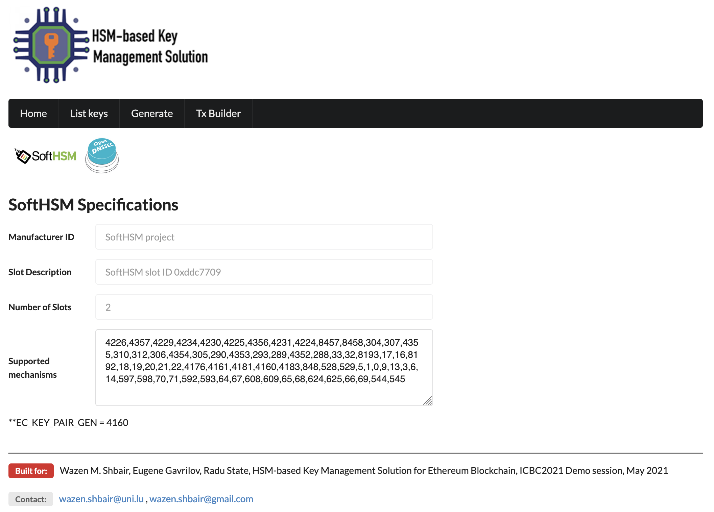

# HSM-based Ethereum Key Management Solution
Use HSM to generate and sign Ethereum transaction

 
## Credit 
Based on the steps given in [ethereum stackexchange question](https://ethereum.stackexchange.com/questions/73192/using-aws-cloudhsm-to-sign-transactions 
) about using HSM to sign ethereum transactions.

I open source the implementation using [SoftHSM](https://github.com/opendnssec/SoftHSMv2) and [Graphene](https://github.com/PeculiarVentures/graphene).
